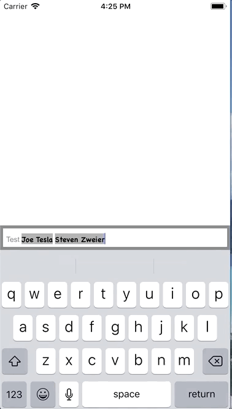

[](https://github.com/Carthage/Carthage)
[](https://codecov.io/gh/szweier/SZMentionsSwift)
[](https://www.paypal.me/szweier)
[](https://travis-ci.org/szweier/SZMentionsSwift)
[](https://img.shields.io/cocoapods/v/SZMentionsSwift.svg)
[](http://cocoadocs.org/docsets/SZMentionsSwift)
[](http://twitter.com/StevenZweier)

SZMentionsSwift is a lightweight mentions library for iOS. This library was built to assist with the adding, removing and editing of a mention within a textview.

## What can it do


#### Add mentions

You can easily add mentions by typing the trigger (default: @) followed by text to filter your list by. Tapping the name will insert the mention into the textView.


#### Insert mentions

Any text, including mentions, that are inserted before other mentions will automatically adjust the ranges for all existing mentions.


#### Delete mentions

If at any point text is changed within an existing mention that mention will be removed from the mentions array and any remaining text associated with that mention will revert to default styling.



For more technical details on usage you can check [here](#Usage)

## How To Get Started

- [Download SZMentionsSwift](https://github.com/stevenzweier/SZMentionsSwift/archive/master.zip) and try out the iOS example app. 

## Communication

- If you **need help**, feel free to tweet [@StevenZweier](http://twitter.com/StevenZweier)
- If you **found a bug**, **have a feature request**, or **have a general question** open an issue.
- If you **want to contribute**, submit a pull request.

## Installation with Carthage

[Carthage](https://github.com/Carthage/Carthage/blob/master/README.md)

#### Cartfile

To integrate SZMentionsSwift into your Xcode project using CocoaPods, specify it in your `Cartfile`:

```
github "szweier/SZMentionsSwift"
```

Then, run the following command:

```bash
$ carthage update
```

[More Info Here](https://github.com/Carthage/Carthage/blob/master/README.md#adding-frameworks-to-an-application)

## Installation with CocoaPods

[CocoaPods](http://cocoapods.org) 

#### Podfile

To integrate SZMentionsSwift into your Xcode project using CocoaPods, specify it in your `Podfile`:

```ruby
source 'https://github.com/CocoaPods/Specs.git'
platform :ios, '8.0'

pod 'SZMentionsSwift'
```

Then, run the following command:

```bash
$ pod install
```

## Usage

Below is a quick run through of the objects used in this library but as always the best place to get an understanding of the current implementation of the SZMentionsSwift library is in the example code.

#### MentionsSwiftListener

This class manages the mention interaction.

##### Setup
Use one of the many initializers to setup your mentions listener.  Parameters explained below:

`mentionsTextView` : **required** The text view we are applying the mentions listener to. Note: it's delegate **must** be the mentions manager.

`delegate` : **optional** If you would like to receive UITextView delegate methods set this and it will be passed through after processing view the mentions listener.

`mentionTextAttributes` : Attributes (see: `AttributeContainer`) to apply to the textview for all mentions

`defaultTextAttributes` : Attributes (see: `AttributeContainer`) to apply to the textview for all text that is not a mention.

`spaceAfterMention` : **optional** Whether or not you would like a space to be added to the end of your mentions. Default is `NO`

`trigger` : The string used to start a mention. Default is `@`

`cooldownInterval` : **optional** The amount of time to wait between calling showMentionsList. Default is `0.5`

`searchSpaces` : **optional** Mention searches can / cannot contain spaces

`hideMentions` : **required** Block of code that is run when the mentions view is to be hidden

`didHandleMentionOnReturn`: **required** Block of code that is run when enter is hit while in the midst of editing a mention.
     Use this block to either:
     - 1. add the mention and return true stating that the mention was handled on your end (this will tell the listener to hide the view)
     - 2. return false stating that the mention was NOT handled on your end (this will allow the listener to input a line break).

`showMentionsListWithString`: **required** Block of code that is run when the mentions list is to be shown

##### Properties

`mentions` : **readonly** Array of all mentions currently applied to the text view.

##### Methods

`public func reset()` : Call this method to reset your textView's text to an empty string and also remove any existing mentions.

`@discardableResult public func addMention(_ mention: CreateMention) -> Bool` : Call this method while adding a mention to apply the mention to the current text.

`public func insertExistingMentions(_ existingMentions: [CreateMention])`: Insert mentions into an existing textview.  This is provided assuming you are given text
along with a list of users mentioned in that text and want to prep the textview in advance.

#### CreateMention (Protocol)

This protocol contains the required properties for a mention being sent to the mentions listener

#### AttributeContainer (Protocol)

This protocol contains the required properties for attributes to be applied to attributed text

#### Mention

This struct is returned via the `mentions` method, it includes the `range` of the mention as well as `object` containing the object sent to the mentions listener via the `addMention(_ mention: CreateMention)` method.
    

## Unit Tests

SZMentionsSwift includes unit tests which can be run on the SZMentionsSwift framework.

## Credits

SZMentionsSwift was originally created by [Steven Zweier](http://twitter.com/StevenZweier)


